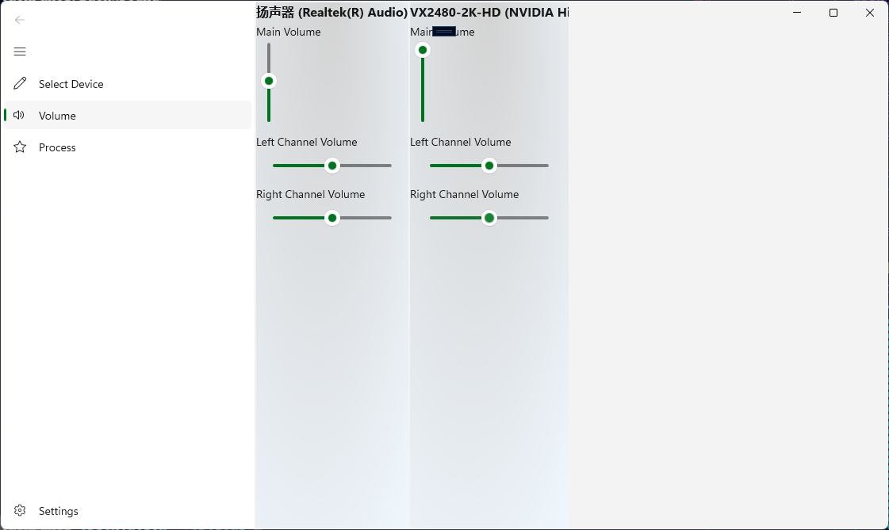

# ReBuild分支
本次推送只为在远端进行备份，当前分支程序并不可用
## 概述
旨在使用更为现代的WinUI3框架对项目进行重构，以期更美观更便捷的UI设计。在UI彻底完成重构之前，功能性内容将在本分支内完成。
### 开发中的功能
- 通过对NAudio库中的AudioSessionControl类型的继承并拓展IChannelAudioVolume相关接口，得到SAudioSessionControl类型，以便能够访问指定进程与音频终结点设备的会话，进而以进程为单位控制音频各通道的音量大小等细节。
### 预览

# ScreenSoundSwitch
- A C#  playback device management application that enable to switches audio playback devices based on the screen where the process window is located.
- 一个能够根据进程窗口所在屏幕来切换播放设备的C#播放设备管理应用
## 环境
- OS: Windows 10
- Dev: .NET 8.0
## 功能实现
- 切换播放设备的功能实现来自[SoundSwitch](https://github.com/Belphemur/SoundSwitch/tree/dev/SoundSwitch)
- 监听其他窗口活动通过Win32 API [setWinEventHook](https://learn.microsoft.com/zh-cn/windows/win32/api/winuser/nf-winuser-setwineventhook)，监听聚焦窗口是否发生切换的功能在SoundSwitch项目中已有封装,详见[WindowMonitor.cs](https://github.com/Belphemur/SoundSwitch/blob/dev/SoundSwitch.Audio.Manager/WindowMonitor.cs)，在此基础上添加了[ForegroundWindowMoved](https://github.com/Lingwuxin/ScreenSoundSwitch/blob/master/SoundSwitch.Audio.Manager/WindowMonitor.cs)事务委托，以便监听判断窗口是否移动到其他显示器的显示区域上。
## 使用时可能存在的问题
- 当音乐软件打开桌面歌词时，播放音频的线程有可能会被绑定在歌词窗口上，此时拖动播放器窗口并不会触发设备切换，拖动歌词可正常触发
## 已知问题或待完成功能
### 已知问题
- 最小化到系统托盘后鼠标悬停在应用图标上无法显示应用名称
### 待实现功能
- 当设备信息变更时，根据当前的设备状态自动选择配置信息
- 期望能够实现一个软件混音器，允许指定进程同时使用多个播放设备
- 针对进程调整其不同声道的音量
