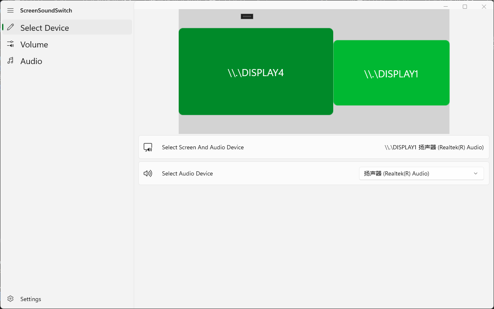
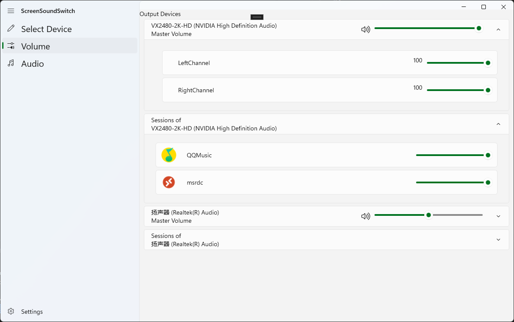
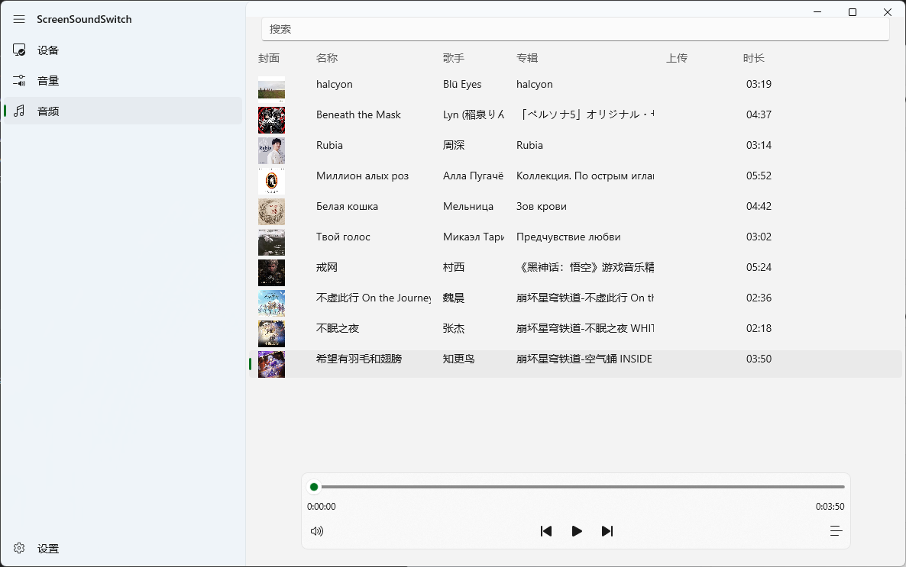

# ScreenSoundSwitch
- A C#  playback device management application that enable to switches audio playback devices based on the screen where the process window is located.
- 一个能够根据进程窗口所在屏幕来切换播放设备的C#播放设备管理应用
## 环境
- OS: Windows 10
- Dev: .NET 8.0
## 概述
该项目是为了在最新版本的windows上实现更便捷的音频播放设备管理器
## 功能与实现
- 切换播放设备的功能实现来自[SoundSwitch](https://github.com/Belphemur/SoundSwitch/tree/dev/SoundSwitch)
- 监听其他窗口活动通过Win32 API [setWinEventHook](https://learn.microsoft.com/zh-cn/windows/win32/api/winuser/nf-winuser-setwineventhook)，监听聚焦窗口是否发生切换的功能在SoundSwitch项目中已有封装,详见[WindowMonitor.cs](https://github.com/Belphemur/SoundSwitch/blob/dev/SoundSwitch.Audio.Manager/WindowMonitor.cs)，在此基础上添加了[ForegroundWindowMoved](https://github.com/Lingwuxin/ScreenSoundSwitch/blob/master/SoundSwitch.Audio.Manager/WindowMonitor.cs)事务委托，以便监听判断窗口是否移动到其他显示器的显示区域上。
### 可使用的功能
- 使用LCtrl+LAlt+鼠标滚轮可调节当前聚焦窗口相关的会话音量。
- 可为每个显示器指定一个音频播放设备，当需要播放音频的进程窗口在显示器之间移动时，会自动切换进程所使用的播放设备
### 开发中的功能
- <del>通过对NAudio库中的AudioSessionControl类型的继承并拓展IChannelAudioVolume相关接口，得到SAudioSessionControl类型，以便能够访问指定进程与音频终结点设备的会话，进而以进程为单位控制音频各通道的音量大小等细节。</del>针对进程调整音量功能已完成，由于IChannelAudioVolume相关接口Windows api文档中并未给出具体的实例化方法，针对进程音频通道调整音量的功能暂无法继续进行。
### 待实现功能
- 当新的会话被创建时，自动将其添加到监听序列中
- 程序最小化到系统托盘运行
- 程序开机自启动功能
- 程序启动时自动获取上一次的配置信息
### 功能预览
同步系统设置中的显示器布局

获取正在使用播放设备的进程

音乐播放

## 构建和发布

项目已配置GitHub Actions自动化工作流程：

### 自动打包
- 推送版本标签时自动构建和打包：`git tag v1.0.0 && git push origin v1.0.0`
- 支持x86、x64、ARM64多架构构建
- 自动生成MSIX安装包
- 自动创建GitHub发布版本

### 持续集成
- 每次推送和Pull Request都会自动验证构建
- 确保代码质量和构建稳定性

详见 [.github/workflows/README.md](.github/workflows/README.md)

## 当前存在的问题
- 项目初期并未按照MVVM的架构开发，导致项目结构混乱，将在功能完成后逐步对各个页面进行重构。