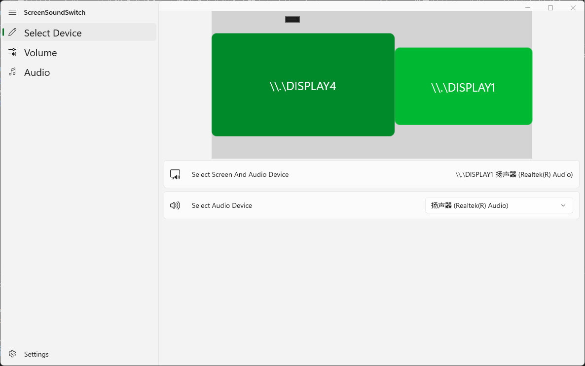
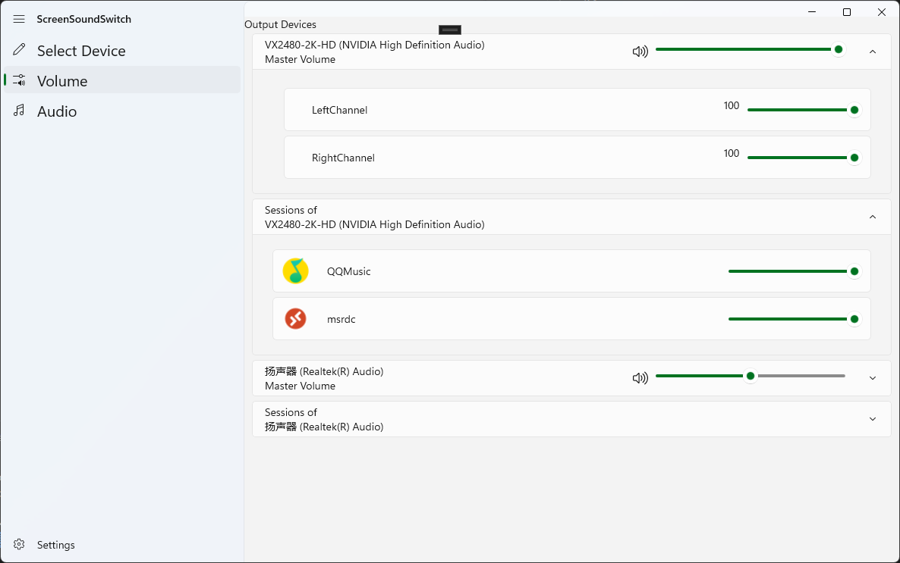

# ScreenSoundSwitch

ScreenSoundSwitch 是一个基于 C# / .NET 8 的 Windows 桌面应用，用于根据应用窗口所在显示器，自动切换该应用使用的音频播放设备。

ScreenSoundSwitch is a C# / .NET 8 Windows desktop app that routes an application's playback device based on which monitor its window is currently on.

## 环境要求

- OS: Windows 10/11
- SDK: .NET 8.0 SDK
- IDE: Visual Studio 2022/2026 (WinUI 3 开发环境)

## 项目概述

本项目聚焦于「多显示器 + 多音响设备」场景：

- 为每个显示器指定一个播放设备
- 监听窗口移动事件
- 当应用窗口跨屏移动时，将该进程的音频会话切换到目标显示器绑定的播放设备

核心实现基于 SoundSwitch 的音频切换能力与窗口事件监听能力，并结合本项目的跨屏路由逻辑扩展。

## 当前能力

- 为每个显示器绑定独立播放设备
- 监听窗口移动并尝试切换对应进程的播放设备
- 使用 `LCtrl + LAlt + MouseWheel` 调节当前聚焦进程会话音量
- 显示当前活跃音频设备及对应进程会话

## 已知限制（请务必阅读）

- 某些第三方播放器（例如部分音乐播放器）对系统级“进程默认音频端点”切换并非即时响应。
- 在这类应用中，路由策略可能已写入成功，但实际生效可能依赖播放器内部重建音频流（如切歌、暂停/恢复、重建会话）。
- 这属于目标应用自身音频引擎行为差异，而非本项目可完全强制控制的范围。

## 构建与运行

```powershell
dotnet restore
dotnet build ScreenSoundSwitch.WinUI/ScreenSoundSwitch.WinUI.csproj
```

在 Visual Studio 中将 `ScreenSoundSwitch.WinUI` 设为启动项目后运行。

## 使用说明

1. 打开“显示器设备选择”页面。
2. 分别为每个显示器选择目标播放设备。
3. 打开目标音频应用（如音乐播放器），并确保已创建音频会话。
4. 将应用窗口拖动到其他显示器，观察是否切换到该显示器绑定设备。

## 待推进事项

- 新会话自动发现与自动纳入路由管理
- 托盘常驻与最小化到系统托盘
- 开机自启动
- 配置持久化与启动自动恢复
- 支持浏览器（如 Edge）多窗口/子窗口级别的独立音频设备绑定（当前仅能按进程级别切换）
- 支持用户手动配置播放设备的空间位置（如 3D 拖拽布局），以适配复杂声道拓扑（例如 5.0/5.1、多声道顺序非 0/1 左右对应）

## 功能预览

同步系统设置中的显示器布局


获取正在使用播放设备的进程
